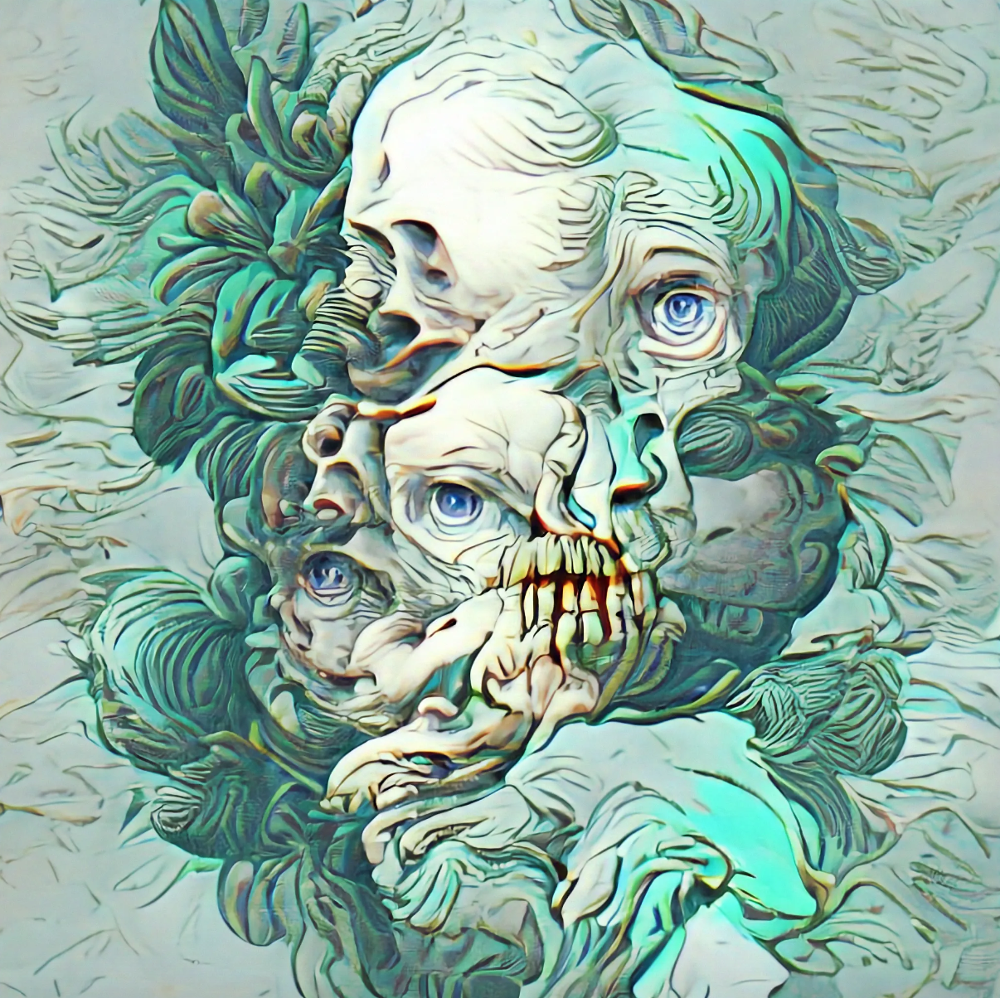
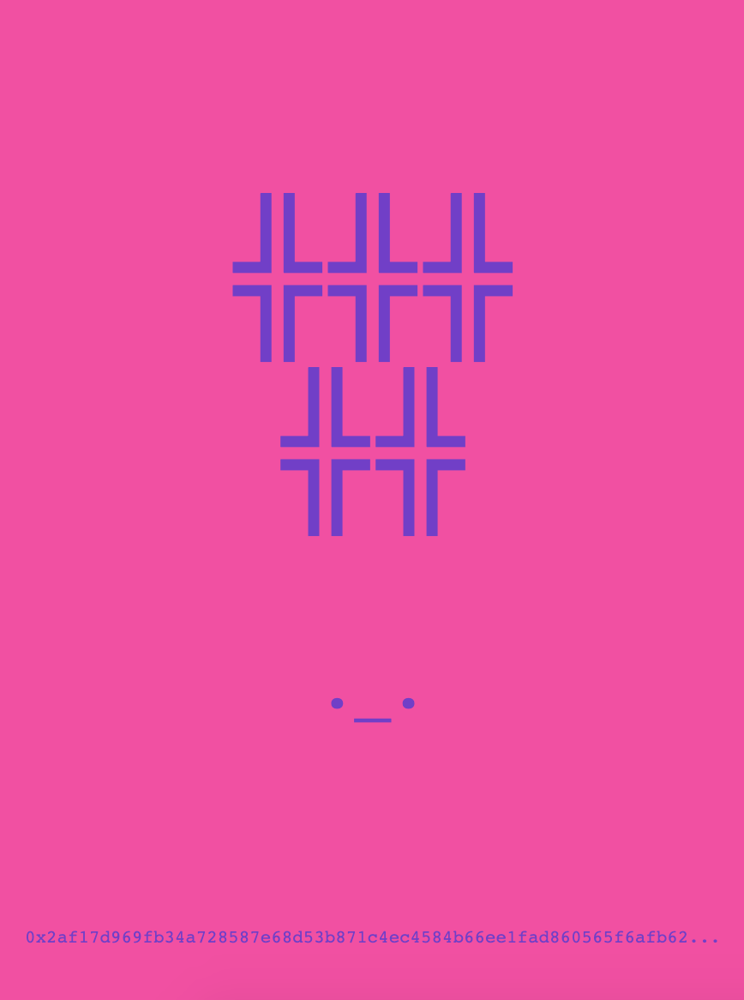
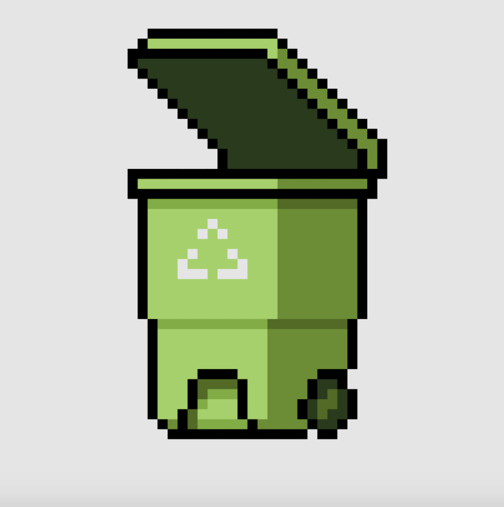

# Permutations

Permutations in the Hashes DAO are are discrete and directed initiatives that the community funds and works together to undertake. Permutations can include things like artist or developer grants, where the DAO allocates funds to support specific projects or individuals. Alternatively, a Permutation may be focused on building generative art infrastructure, which can entail both on and off-chain functionality. All Permutations are proposed and voted on by the members of the DAO, and they should align with the overall ethos and mission of the collective.

During the proposal process of a Permuation, a sponsor (typically the initial proposer) is elected to ensure the successful operation and fulfillment of the Permuation. The sponsor acts as the project manager for the Permutation, and is empowered to make permutation-specific executive decisions on behalf of the DAO. In this way, the sponsor can resolve routine challenges and decisions without requiring active participation by a quorum of DAO members. For instance, a sponsor is empowered to delegate, monitor, and remunerate constributors to a Permutation. Sponsors are typically remunerated for their leadership role in the Permutation also. 

Thus far, six Permutations have been initiated by the Hashes DAO, and they are as follows:

### 1. The Harvest

##### Sponsor: [Meltem Demirors](https://twitter.com/Melt_Dem) (degenprincess)

In the first Permutation the DAO allocated 225 ETH to buy a set of high-value, culturally signigicant, and prestigious NFTs with the goal of establishing a notable collection for the DAO. The hope for this collection is that it will drive value to DAO members and create interest in the DAO among the wider gernerative art space. In the collection are distinguished pieces from artists such as Nick Kuder, Justin Aversano, Snowfro, Refik Anadol, DCA, and Botto, among many others. Browse the full collection on [Opensea](https://opensea.io/hashesDAO).

The art is currently stored in a [multi-sig](https://etherscan.io/address/0x086E6Cfbb7D97d42E0e2A415a3E5674f0aCbD651) managed by five DAO members. These being the Permutation sponsor, degenprincess, along with jenni, EBA, O_Gosh, and generalbarbie. The use of these harvested NFTs in the future includes the potential for fractional ownership for DAO members, museum exhibitions, and potentially selling them for a profit to replenish DAO funds.

### 2. Medleys

##### Sponsor: [Kintsugi](https://twitter.com/KintsugiNFTs) (Hash Hodler)

The second Permutation funded the development of a generative art marketplace that expanded the utility of Hashes NFTs. This permissionless [marketplace](https://thehashes.xyz/medleys) is open for both artists and collectors to mint using a Hashes NFT, making it both accessible to a wide range of users whole also pushing value to the Hashes DAO. In this way, users can collect unique generative art created with the Hashes NFTs or in collaboration with the Hashes DAO, and have early access to future drops by OG generative artists, all while shaping the future of generative art.

In addition to building the marketplace, the Medleys Permutation was also initiated with the premiere of the [Europa collection](https://www.youtube.com/watch?v=phOKE88y9Ks&t=2s&ab_channel=Kintsugi). This collaborative drop by [Joshua Davis](https://twitter.com/JoshuaDavis) and [Jana Stýblová](https://twitter.com/styblova) consisted of 30 unique animated and 60 still NFTs, with 10 aniamted mint allowlist slots being raffled to Hashes NFT holders. 

### 3. The Sigils

##### Sponsor: [Deebee](https://twitter.com/deebee) (thedavidb)

Permutation three introduced the first dynamic and reputation-based NFTs into the Hashes ecosystem, as well as extending the DAO's infrastructure with the Sigil APIs and the Sigil management contract. Beginning with the [Sigil Genesis NFTs](https://www.thesigil.xyz/), which are a collection of dynamic NFTs that change in appearance according to an owner's on-chain activity and contributions to the DAO. Activities such as buying, selling, or moving Hashes NFTs, as well as proposing or voting in DAO governance, will all modify the metadata of an owner's Sigil Genesis. In this way, a Sigil Genesis NFT can act as a source of reputation within the Hashes DAO. These Sigil Genesis NFTs are available to [mint](https://thehashes.xyz/collections/nft/0x013b326320fde7af53b95F498A26e33Eb7a5391c) using a Hashes NFT.

Behind the scenes of the Sigil Genesis collection are the Sigil API endpoints and the Sigil Management contract. It is the Sigil [API endpoints](https://www.api.thesigil.xyz/) that are used to retreive data concerning the relevant on-chain activities of Sigil Genesis owners. This API is available for use by developers and artists looking for insight or inspiration into the Hashes ecosystem. Finally, the Sigil Management contract introduces a novel eligibility criteria for the set of all Sigil NFTs. The Sigil Genesis collection is so named because it is the first of several Sigil collections managed by the Sigil Management contract. This management contract ensures that a standard Hashes NFT can only be used to mint a single Sigil NFT (whether this be from the Genesis collection or otherwise), whereas a DAO Hashes NFT can be used to mint an NFT from each Sigil collection.

Artists interested in exploring these unique features are strongly encouraged to do so, and to reach out for more information on [Discord](https://discord.com/channels/895057713279676427/895391609586323457).

### 4. The TrashBin

##### Sponsor: [Θr](https://twitter.com/trad0r)

In Permutation four the Hashes DAO tackled a fundamental issue with NFTs by building the [JPEG Trash Bin](https://www.jpegtrashbin.xyz/). This core issue being that NFTs tend to be highly illiquid, with most having the unenviable position of possessing no active bids whatsoever. This poses a real problem for traders and investors looking to tax loss harvest at the end of the financial year, only to find that there are no counter-parties for their trades. The JPEG Trash Bin resolves this problem of terminal illiquidity by placing a permanent and implicit bid on every NFT on Ethereum.  

The JPEG Trash Bin allows anyone to sell their illiquid NFTs on Ethereum to a smart contract in exchange for a small amount of ETH. Furthermore, this dApp also provides users with a marketplace where collectors can “dumpster dive” for NFT gems that others have previously trashed. Discounts on these re-purchases are available for standard (25% discount) and DAO (75% discount) Hash holders respectively. After an NFT is sold to the JPEG Trash Bin, it will be held for 20,000 blocks (roughly 3 days) to see if the DAO wishes to purchase it. After that holding period it will be open and available for anyone to purchase. Profits from the JPEG Trash Bin are divided between the builders and the Hashes DAO as an incentive alignment mechanism to promote further development and promotion.

### 5. Developer Grants

##### Sponsor: [SydneyJason](https://twitter.com/hall_jason)

When Permutation five was proposed several prior Permutations had already been initiated and voted for by the community. Development work was, however, at a stand-still, with no technical contributors stepping up to build the proposed projects due to the absence of a compensation mechanism. Dex Labs, the original technical sponsor of the HashesDAO (and holder of 100 HashesDAO NFTs) was also understaffed and unable to build out these Permutations. And so, in order to address this issue, the HashesDAO proposed a development framework to complete the backlog of defined development projects as well as to guide future development efforts for upcoming Permutations. 

Approximately 50 ETH was allocated to incentivise developers and builders who could finish the Permuations that had already been initiated, as well as to further develop the Hashes DAO website and resources. The Permutation was highly successful, with core proposals of both Permuation three and four being completed as a result. Furthermore, Permutation five also funded the development of the Hashes DAO NFT [create-flow](https://thehashes.xyz/collections/new), along with the DAO documentation you're reading right now! 

Further detail regarding Permutation five can be found [here](https://medium.com/@sydneyjason/permutation-5-the-build-e6f420102d09).

### 6. Photography Grant

##### Sponsor: [Quimp](https://twitter.com/bquimper)

For Permutation six, which is ongoing at the time of writing, 15 ETH has been allocated for artist [Carlo Van de Roer](http://www.vanderoer.com/new-page-1) to create generative photographic works using his patented PlateLight technology. Van de Roer is an artist who specializes in photography and film-making, and has already created works such as [The Portrait Machine Project](https://opensea.io/collection/tpmp), and [Modular One](https://opensea.io/collection/carlo-van-de-roer-modulator-one), among several others. Furthermore, this unique artistic approach has been employed in the Marvel movies "Thor: Ragnarok" and "Thor: Love and Thunder." 

The proposed project involves using Hashes NFTs to allow collectors to generate and collect unique photographic images, and will include a website for minting the images and connecting them to smart contracts. The resulting body of work will consist of 50-100 unique 1/1's and will be available to purchase at an approximate price of 1.5 ETH. Several pieces will also be allocated to the DAO's harvest treasury, along with others raffled to DAO hashes holders.