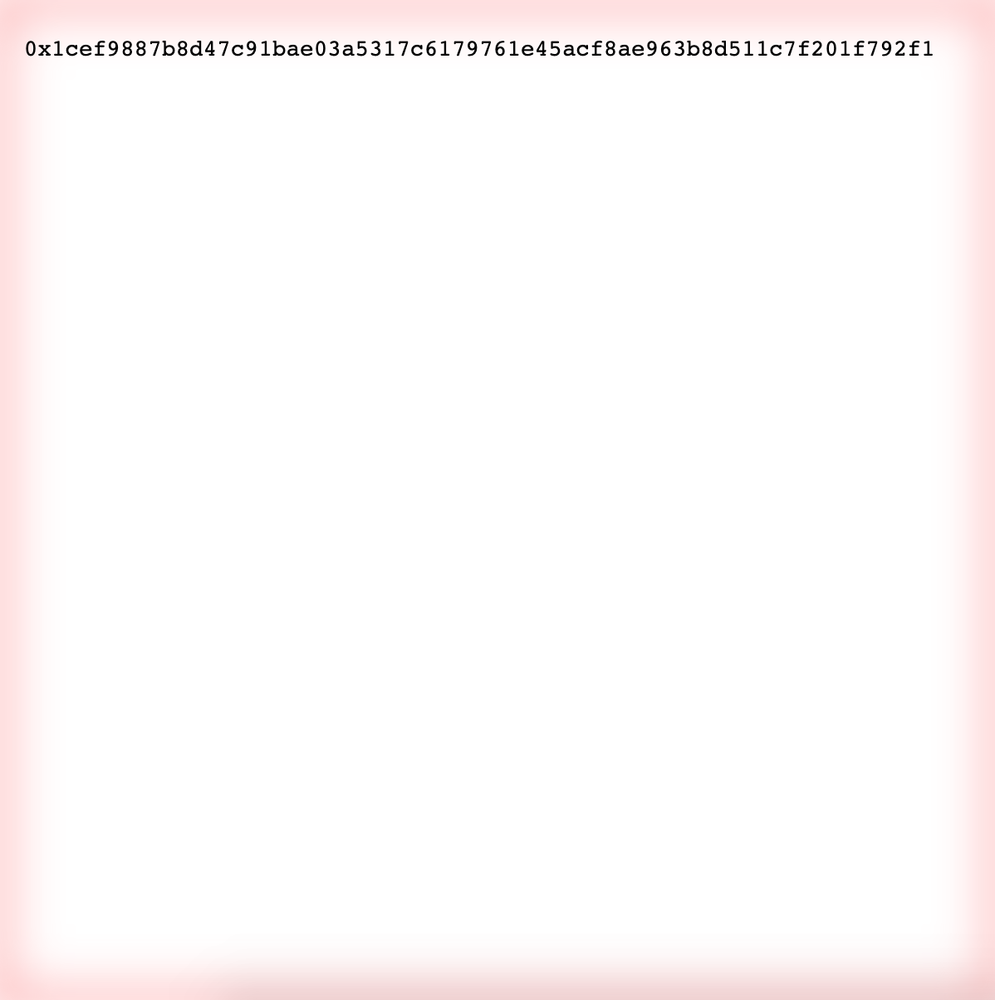

# Tokenomics

At the heart of the Hashes DAO is the Hashes NFT, which conforms to the ERC721 NFT standard and has several simulatenous roles and functions within the organisation.

To begin with, the Hashes DAO utilizes a unique mechanism for minting its NFTs. Each NFT has an associated hash (hence the name!) and is minted using a specific phrase or message that is provided when minting. In practice this means that the hash associated with each NFT is deterministically generated when minting occurs. Specifically, users can mint a Hashes NFT by providing a phrase of their choice that is then hashed along with a monotonically increasing nonce (tokenId) and the minter's Ethereum address using the Keccak-256 hash function. This results in generating a unique 32-byte hash value for the token.

### Types and Functions

The Hashes NFT acts as the leading NFT of the ecosystem, a pseudo-random source of entropy for digital art, and a coordination mechanism for governance and on-chain operations. The [Hashes NFT collection](https://opensea.io/collection/hashes) is divided into three categories: DAO Hashes, Standard Hashes, and Deactivated DAO Hashes:

- DAO Hashes are the governance tokens of the DAO, and holders of these NFTs have the right to participate in the decision-making processes of the organization. Principally, DAO Hashes holders have the right to propose and vote on permutations, along with having shared ownership rights over the DAO's assets, namely the Permuation One NFTs. DAO Hashes holders also have exclusive access to community discord servers where operations and community initatives are discussed. When the DAO was founded in late 2021 the first 100 Hashes NFTs where reserved by [Dex Labs](https://twitter.com/DEXLabs1), the primary founders of the DAO, with a subsequent 900 being made available to the public to mint for one Ether each. This was the initial capital raise of the DAO and a maximum of 1000 DAO hashes can exist.

- Standard Hashes, on the other hand, do not convey governance rights and are mainly used as an entry point into the DAO allowing the community to expand organically. Standard Hashes are currently free to [mint](https://thehashes.xyz/) on Ethereum mainnet and can be used to mint hashes collections, such as [Sigils Genesis](https://thehashes.xyz/collections/nft/0x013b326320fde7af53b95F498A26e33Eb7a5391c), or in order to recieve discounts on purchases from the Trash Bin. 

- Lastly, Deactivated Hashes are former DAO Hashes that have had their governance rights revoked voluntarily by holders, and they now operate identically to standard hashes in the Hashes DAO ecosystem. Deactivated DAO hashes can be reactivated by holders who re-commit one Ether back to the DAO. At the time of writing there exist 15 Deactivated DAO hashes, meaning that the DAO is governed by 985 DAO Hashes.
